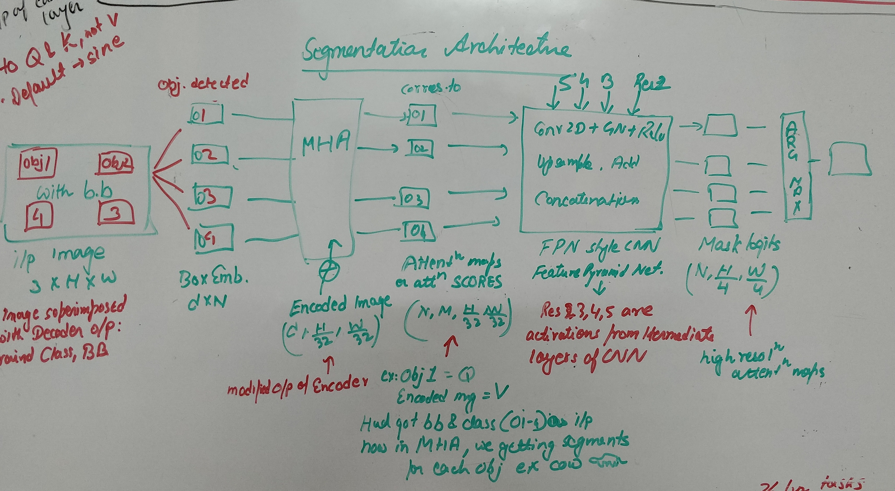

 Questions that will be answered in this doc:

 

   Ques1:   FROM WHERE DO WE TAKE THIS ENCODED IMAGE?  
   Ques2:   WHAT DO WE DO HERE?  
   Ques3:   WHERE IS THIS COMING FROM?  
   Ques4:   EXPLAIN EACH STEP.  
   
    
   
   Answer1: The output of Transformer Encoder is a hidden state of size [H/32, W/32, 256]. This is flattened as [H/32 X W/32, 256] before passing to the Decoder Multi-head attention in the cross-attention layer. The original hidden state [H/32, W/32, 256] is the Encoded image that is passed to the Multi-head attention for calculating segmention maps.
   
   
   Answer 2: In the Multi-head attention mentioned above, along with Encoded image, Box embeddings [d,N] are also passed. Each Box embedding corresponds to a particular object in the Image generated by the Decoder(image superimposed with Bounding boxes). These are the 'Query' in the attention layer whereas Encoded image is the 'Value'. The output of this layer after dot matrix multiplication [ [N,d] x [d, H/32, W/32] ] is [N,H/32, W/32] divided into 'M' heads. These are called Attention maps.
   
   Answer 3: The Resnet residuals are frozen after training and fed in the 'FPN style CNN' block for image upsampling. The Resnet residuals are extractred from each of the 5 blocks(except 1st) of RESNET 50 and stored in half-resolution to optimize storage and computation. The input to this block are the Attention maps generated in the previous layer. These maps are upsampled 8 times from their input dimensions of  [H/32, W/32] making it  [H/4, W/4]. The 'M' attentions maps after upsampling are concatenated giving the final dimention of [N, H/4, W/4]. These are called Masked Logits.
   The question here however is why did they choose 1/4th resolution, why not 1/8 or 1/2 or even 1? 
   
   Answer4: the final step left in the image segmentation pipeline is computing Argmax of the each pixel assigning a unique mask to it. The question here however is how does the model find which pixel in the image[3,H, W] corresponds to which pixel in the mask logits[N, H/4, W/4]?
  
#This is the code that is the only addition to panoptic model verses plain DETR model

    (bbox_attention): MHAttentionMap(
      (dropout): Dropout(p=0.0, inplace=False)
      (q_linear): Linear(in_features=256, out_features=256, bias=True)
      (k_linear): Linear(in_features=256, out_features=256, bias=True)
      )
      (mask_head): MaskHeadSmallConv(
        (lay1): Conv2d(264, 264, kernel_size=(3, 3), stride=(1, 1), padding=(1, 1))
        (gn1): GroupNorm(8, 264, eps=1e-05, affine=True)
        (lay2): Conv2d(264, 128, kernel_size=(3, 3), stride=(1, 1), padding=(1, 1))
        (gn2): GroupNorm(8, 128, eps=1e-05, affine=True)
        (lay3): Conv2d(128, 64, kernel_size=(3, 3), stride=(1, 1), padding=(1, 1))
        (gn3): GroupNorm(8, 64, eps=1e-05, affine=True)
        (lay4): Conv2d(64, 32, kernel_size=(3, 3), stride=(1, 1), padding=(1, 1))
        (gn4): GroupNorm(8, 32, eps=1e-05, affine=True)
        (lay5): Conv2d(32, 16, kernel_size=(3, 3), stride=(1, 1), padding=(1, 1))
        (gn5): GroupNorm(8, 16, eps=1e-05, affine=True)
        (out_lay): Conv2d(16, 1, kernel_size=(3, 3), stride=(1, 1), padding=(1, 1))
        (adapter1): Conv2d(1024, 128, kernel_size=(1, 1), stride=(1, 1))
        (adapter2): Conv2d(512, 64, kernel_size=(1, 1), stride=(1, 1))
        (adapter3): Conv2d(256, 32, kernel_size=(1, 1), stride=(1, 1))
      )
    )
